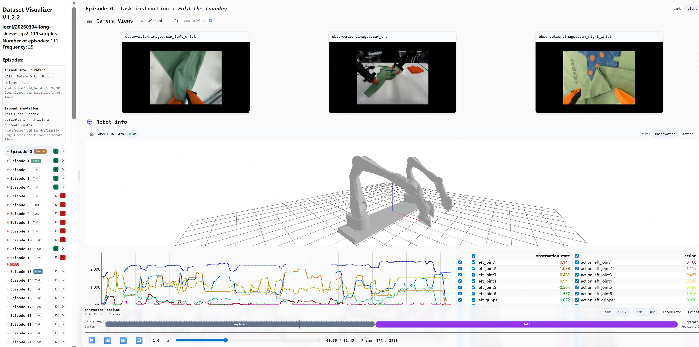

# Changelog

本文件遵循 [Keep a Changelog](https://keepachangelog.com/zh-CN/1.1.0/) 格式。

## [0.3.0] - 2026-06-14

### Summary

v0.3.0 新增**直接从 BOS / S3 在线浏览 Lance 数据集**的能力。启动时给一个对象存储前缀（`--bos-prefix bos://.../`），Scribe 会列出该前缀下所有 Lance 数据集形成一个登录页（landing page）；点击任意数据集即按需打开，机械臂列和相机 GOP blob 通过 Lance 的 object_store 直接从 BOS 流式读取，无需先把整份数据集下载到本地。标注 sidecar 在打开时从 BOS 拉到本地缓存，编辑落本地文件，再由后台线程 / Save / 驱逐 / 退出时自动回写 BOS。

> 数据直读原理：BOS 与 S3 协议兼容，代码在边界把 `bos://` 改写成 `s3://`，真实 endpoint 由 `AWS_ENDPOINT_URL` 指定；凭据走标准 `AWS_*` 环境变量。只有 materialize 出来的 MP4 会缓存到本地 runtime 目录。
>
> 本版本为**单用户 MVP**：未实现多用户并发冲突检测，多人同时标注同一数据集会互相覆盖。

### Added

- 新增 `--bos-prefix bos://.../`（或 `s3://`）CLI 入口，进入 landing 模式；与 `--root` / `--repo-id` / `--load-from-hf-hub` 互斥。
- 新增 `scribe/bos_discovery.py`：列举 BOS 前缀下的 Lance 数据集，识别两种形态——`merged`（单个 `<name>.lance`）与 `raw_episodes`（含 `episode_*.lance` 的目录），带 60s 进程内缓存。
- 新增 `scribe/dataset_registry.py`：进程级数据集注册表，LRU 懒加载远程 `LanceDataset`，slug 冲突自动消歧，驱逐时 flush 标注。
- 新增 `scribe/bos_sync.py`：标注 sidecar 的 pull / push 桥接层 + `AutoSaver` 后台周期回写线程。
- 新增 `scribe/templates/landing.html`：数据集选择登录页。
- 新增 `scripts/run_bos.sh`：BOS landing 模式启动脚本（凭据走环境变量，不硬编码）。
- `LanceDataset` / episode 发现支持 `bos://` / `s3://` URI 直读（scheme 改写 + Lance object_store）。
- 新增 landing / 同步相关路由：
  - `GET /`（landing 模式下渲染数据集列表）
  - `POST /api/bos/refresh`（清缓存、刷新列表）
  - `POST /<ns>/<name>/api/sync-now`（立即回写该数据集标注到 BOS）
  - `GET /<ns>/<name>/api/sync-status`（查询同步状态）
- 新增配置项：
  - `--autosave-interval-s`（默认 60）：标注后台回写 BOS 的间隔。
  - `SCRIBE_DATASET_LRU`（默认 3）：同时常驻内存的远程数据集数量上限。
  - `AWS_*` / `AWS_ENDPOINT_URL`：BOS 访问凭据与 endpoint。
- 新增依赖 `s3fs==2025.3.0`：供 `fsspec.ls` / `fsspec.exists`（BOS 发现与标注同步）使用。

### Changed

- 数据集不再只能在进程启动时固定加载一个；landing 模式下由 `DatasetRegistry` 在用户点击时按需构造。
- 远程数据集的标注上下文指向本地 sync 缓存槽（`<output_dir>/bos_annotation_cache/<ns>__<name>/annotations/`），标注 CRUD 仍是纯 `pathlib` 本地写。

### Known Limitations

- 单用户 MVP：`_check_remote_changed_since` 为 stub（恒返回 False，直接覆盖），无多用户冲突检测。
- 远程模式下首次打开 episode 仍需等待三路视频从 BOS 拉取并 materialize 完成。
- Lance 数据集上的标注链路（curation / segment / frame event / export）整体仍待专项验证（沿用 v0.2.0 边界）。

## [0.2.0] - 2026-04-27

### Summary

v0.2.0 主要完成 Scribe 对本地 Lance 数据集的可视化适配，让单个 `.lance` episode 或包含 `episode_*.lance` 的目录可以直接进入原有的多相机视频、时序曲线、表格和 3D 机械臂联动界面。本版本重点保证“原始数据可视化”：机械臂行数据不降采样，相机画面尽量保持 Lance 中的 H264 GOP 原始内容，仅做浏览器可播放的 MP4 materialize。

> 说明：本版本尚未完成 Lance 数据集上的标注流程测试与专项适配。Episode curation、segment annotation、frame event 等标注能力仍以既有 LeRobot 本地数据集为主；Lance 标注验证和必要修正放到下一个版本。

### Added

- 新增 `LanceDataset` 后端适配层，用于在 Scribe 中 duck-type 兼容 LeRobotDataset 的关键字段和方法。
- 支持 `--root` / `DATASET_ROOT` 指向单个 `.lance` 目录，或指向包含多个 `episode_*.lance` 的目录。
- 支持从 Lance schema/metadata 发现 episode、相机列、关节名、任务文本和基础时序信息。
- 支持将 Lance 中的 H264 Annex B GOP blob 按需 materialize 为浏览器可播放的 MP4。
- 支持 `left` / `mid` / `right` 三路相机画面在原有 Scribe 前端中同步播放。
- 支持由 `*_gop_index` 和 `*_frame_index_in_gop` 计算每一行 robot state 对应的 MP4 内部帧号。
- 新增 `get_episode_video_seek_info()` 返回 Lance 专用 seek 映射，供前端按真实视频帧同步曲线、表格和 3D 机械臂。
- 新增 Lance runtime 视频缓存目录，缓存路径包含 `VIDEO_CACHE_VERSION`，避免不同 materialize 策略混用旧 MP4。
- 新增 Lance 启动和预加载配置：
  - `LANCE_PREENCODE_ALL=false`：默认不在启动时全量生成所有视频。
  - `LANCE_PRELOAD_NEXT=true`：打开当前 episode 后后台预加载下一集。
  - `LANCE_VIDEO_WORKERS=3`：默认三路相机并行 materialize。
- 新增 `pixi run build-pylance` 和 `pixi run build-pylance-wheel`，用于安装带 Lance blob 支持的 pylance 环境。

### Changed

- Lance 视频 materialize 从“一次性拼接完整 H264 bytes 后交给 ffmpeg”改为“逐 GOP blob 流式写入 ffmpeg stdin”，减少 Python 侧内存峰值。
- GOP first-row indices 和 row-to-video-frame 映射现在会按相机缓存，避免重复扫描 `*_gop_index` / `*_frame_index_in_gop`。
- 当前 episode 的视频 materialize 会与 CSV/metadata payload 构建并行执行，减少首次打开等待时间。
- 当前 episode 的视频生成仍会在返回视频 URL 前等待完成，避免前端拿到空文件或不存在的 MP4。
- 下一集预加载继续在后台执行，失败只记录日志，不阻塞当前页面。
- 三相机视频 materialize 默认并发从 1 提升到 3，更符合 `left` / `mid` / `right` 的常见数据结构。
- Scribe 前端播放同步优先使用 `requestVideoFrameCallback`，按实际呈现的视频帧驱动 Dygraph selection、表格和 3D 机械臂。
- README、CLAUDE 开发文档补充 Lance 数据格式、运行方式、性能开关、对齐原则和版本边界。

### Fixed

- 修复 Lance 首次打开时视频预加载失败只在后台 warning、页面可能表现为空视频的问题：当前 episode materialize 失败会向调用方抛出明确错误。
- 修复三路相机并行 materialize 时 episode 内部缓存缺少锁保护的潜在竞态。
- 修复 `annotation_store.py` 中未使用 import 导致的 lint 问题。
- 补齐 ruff format，使 `pixi run check` 通过。

### Verified

- `pixi run check` 通过：
  - `ruff check scribe/`
  - `ruff format --check scribe/`
  - `python -m py_compile ...`
- 使用真实 Lance 数据完成 smoke test：
  - 数据路径：`/home/jovyan/code/lance_data_collections/20260420_qz4_bigshirt/episode_0005.lance`
  - 三路相机 MP4 均成功 materialize。
  - `get_episode_video_seek_info()` 返回 `observation.images.left` / `mid` / `right` 的 seek 映射。
  - CSV、列信息和视频 seek 信息可正常生成。

### Known Limitations

- Lance 数据集上的标注流程尚未完成专项测试；下一版本需要验证并修正 sidecar 标注、frame event、segment annotation 与 Lance episode/frame 映射的兼容性。
- 首次打开某个 Lance episode 仍需等待当前 episode 的三路视频 materialize 完成；本版本优化了并发和内存，但没有改成“边生成边播放”。
- H264 copy remux 失败时会 fallback 到 intra-frame encode，文件更大、耗时更高。
- 当前 payload 仍会一次性生成整集 CSV；超长 episode 后续可继续优化为分块数据接口。

## [0.1.0] - 2026-04-03
### Screenshots

### Added

- 多相机视频同步播放 + Dygraph 时序曲线
- SBS1 双臂 3D 联动（URDF 驱动）
- Episode Curation（Keep / Delete 标记）
- Sparse Stage Segment 标注
- Frame Event 帧级标注
- 离线导出训练工件（progress label、clip manifest）
- Dark / Light 主题切换
- Episode 同页切换（无刷新）

### Changed

- 包名重命名为 `scribe`，模块拆分为 `app` / `routes` / `data` / `annotation_store` / `export`
- 使用 pixi 管理依赖，ruff 进行代码检查
- 标注数据采用 sidecar 存储，不改写原始数据集
